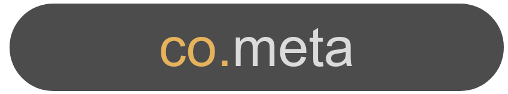

# Co.meta actions table of contents

1. [QueryStudio actions](#QUERYSTUDIO_AC)
2. [Browser actions](#BROWSER_AC)
3. [CSS selectors actions](#CSS_AC)
4. [Feature actions](#FEATURE_AC)
5. [Mouse actions](#MOUSE_AC)
6. [Keyboard actions](#KEYBOARD_AC)
7. [IBM actions](#IBM_AC)
8. [Other actions](#OTHER_AC)

# Selectors table of contents

1. [How is an HTML page structured?](#HTML_SE)
2. [What are CSS selectors?](#CSS_SE)
3. [What is XPath](#XPATH_SE)
4. [Using XPath](#USEXP_SE)
   1. [Descendant selectors](#DES_XP)
   2. [Attribute selectors](#ATT_XP)
   3. [Order selectors](#ORD_XP)
   4. [Siblings](#SIB_XP)
   5. [Jquery selectors](#JQU_XP)
   6. [Other selectors](#OTH_XP)
   7. [Steps and axes](#STAX_XP)
   8. [Prefixes](#PRF_XP)
   9. [Predicates](#PRD_XP)
   10. [Operators](#OPE_XP)
   11. [Using nodes](#NOD_XP)
   12. [Indexing](#IND_XP)
   13. [Chaining order](#COR_XP)
   14. [Node functions](#NFC_XP)
   15. [Boolean functions](#BFC_XP)
   16. [Type conversion](#TFC_XP)
   17. [String functions](#SFC_XP)
   18. [Axes](#AXE_XP)
   19. [Unions](#UNI_XP)
5. [Support](#SUPPORT_SE)

 

# Co.meta actions

### 1. QueryStudio actions

<table>
    <tr>
        <th>Action</th>
        <th>Description</th>
        <th>Example</th>
    </tr>
    <tr>
        <td>I can sort QueryStudio table column with "{column_name}"</td>
        <td>Sort a QueryStudio table by a given column name</td>
        <td></td>
    </tr>
    <tr>
        <td>I can add an column with "{column_name}" to QueryStudio table </td>
        <td>Add a column name in a QueryStudio table</td>
        <td></td>
    </tr>
    <tr>
        <td>I can add an filter with "{filter_name}" to QueryStudio table</td>
        <td>Add a filter name to a QueryStudio table</td>
        <td></td>
    </tr>
    <tr>
        <td>I can add an filter to column "{column_name}" with "{filter_value}" to QueryStudio table</td>
        <td>Add a filter name with a value to a QueryStudio table</td>
        <td></td>
    </tr>
    <tr>
        <td>I can set not to the filter "{filter_text}"</td>
        <td>Negate a filter name</td>
        <td></td>
    </tr>
    <tr>
        <td>I can remove the filter "{filter_text}" </td>
        <td>Remove a filter name from a QueryStudio table</td>
        <td></td>
    </tr>
    <tr>
        <td>I can delete QueryStudio table column with "{column_name}" </td>
        <td>Remove a column name from a QueryStudio table</td>
        <td></td>
    </tr>
    <tr>
        <td>I can cut QueryStudio table column with "{column_name}" and paste it before column with "{column_name_2}"</td>
        <td>Moves a column name before another column name</td>
        <td></td>
    </tr>
</table>

### 2. Browser actions

<table>
    <tr>
        <th>Action</th>
        <th>Description</th>
        <th>Example</th>
    </tr>
    <tr>
        <td>StartBrowser and call URL "(url)"</td>
        <td>Browse to an URL</td>
        <td></td>
    </tr>
    <tr>
        <td>Goto URL "{url}"</td>
        <td>Browse to an URL</td>
        <td></td>
    </tr>
    <tr>
        <td>Maximize the browser</td>
        <td>Maximizes the browser window</td>
        <td></td>
    </tr>
    <tr>
        <td>I resize the browser to "{x}" x "{y}"</td>
        <td>Resizes the browser window to X and Y, useful for virtual mobile testing</td>
        <td></td>
    </tr>
    <tr>
        <td>I can resize the browser to "{x}" x "{y}"</td>
        <td>Checks if it can resize the browser window to X and Y, useful for virtual mobile testing</td>
        <td></td>
    </tr>
    <tr>
        <td>I can close the window </td>
        <td>Closes the current window</td>
        <td></td>
    </tr>
    <tr>
        <td>Close the browser</td>
        <td>Closes the browser and reverts to latest opened tab/window if available</td>
        <td></td>
    </tr>
    <tr>
        <td>I can close the window</td>
        <td>Closes the current window</td>
        <td></td>
    </tr>
    <tr>
        <td>I can switch to new Window </td>
        <td>Switches to another existing (or just created) Window/Tab (e.g. popup window)</td>
        <td></td>
    </tr>
    <tr>
        <td>I can switch to main Window</td>
        <td>Switches to the main Window/Tab</td>
        <td></td>
    </tr>
    <tr>
        <td>I switch to default content </td>
        <td>Changes the testing context to the main document in the current Tab/Window, similar to using window.top  
        I can switch back to default content, e.g. if I switched to iFrame before</td>
        <td></td>
    </tr>
    <tr>
        <td>BrowserTitle is "{browserTitle}"</td>
        <td>Checks if the current Tab Title is/contains some sentence</td>
        <td></td>
    </tr>
    <tr>
        <td>Reload page </td>
        <td>Reloads the current page 
        Useful to reset to default settings (e.g. if elements are marked in a different color)</td>
        <td></td>
    </tr>
</table>

### 3. CSS selectors actions

<table>
    <tr>
        <th>Action</th>
        <th>Description</th>
        <th>Example</th>
    </tr>
    <tr>
        <td>I move mouse to "{css_selector}" and
click</td>
        <td>Moves the mouse to the css selector and click</td>
        <td>when I Move mouse to "[id="ibis-contract-search:ibis-contractstates"]" and click</td>
    </tr>
    <tr>
        <td>I move mouse over "{css_selector}"</td>
        <td>Moves the mouse to the center of css selector</td>
        <td>when I move mouse over "[id="ibis-fvn:ibis-contractcontext-selected"]"</td>
    </tr>
    <tr>
        <td>Focus on element with "{css_selector}"</td>
        <td>Focus on element using a CSS selector</td>
        <td>when I Focus on element with "[id="ibis-fvn:ibis-contractsearch"]"</td>
    </tr>
    <tr>
        <td>I can click on element with css selector "{css_selector}"</td>
        <td>Checks if it can click on an element using a CSS Selector</td>
        <td>then I can click on element with css selector "[id="ibis-fvn:ibis-searchcontract"]"</td>
    </tr>
    <tr>
        <td>I can see element with css selector "{css_selector}"</td>
        <td>Checks if it can see an element using a CSS Selector</td>
        <td>then I can see element with css selector "[id="ibis-fvn:ibis-searchcontract"]"</td>
    </tr>
    <tr>
        <td>Check if "{css_selector}" contains "{value}" in "{css_property}"</td>
        <td>Checks if an element contains a given text inside a css-property like background-image, fontSize, etc.</td>
        <td></td>
    </tr>
    <tr>
        <td>Check if "{css_selector}" contains "{value}" in JS property "{js_property}"</td>
        <td>Checks if an element contains a given text inside a js-property like innerText.  Use "caseInsensitive:" to ignore the spelling of the value.</td>
        <td>Check if "[id="ibis-welcometext"]" contains "$SAW_User" in JS property "innerText"  Check if "td.pf > table.tb > tbody > tr > td:nth-child(1) > span:nth-child(1)" contains "caseInsensitive:$SAW_username" in JS property "innerText"</td>
    </tr>
    <tr>
        <td>Scroll to element with css selector "{selector}"</td>
        <td>Scroll to an element using a CSS Selector</td>
        <td></td>
    </tr>
    <tr>
        <td>There is no coincidence with css selector "{selector}"</td>
        <td>Checks if an element doesn't exist using a CSS Selector</td>
        <td></td>
    </tr>
    <tr>
        <td>Save selector "{css_selector}" value to environment variable "{variable_name}"</td>
        <td>save css-selector's property value if available else gets selector's innerText and saves it as an environment variable, environment variable value has a maximum value of 255 characters</td>
        <td>Save selector "#ibis-fhn:ibis-center-id_label" value to environment variable "center"</td>
    </tr>
    <tr>
        <td>Save list values in selector "{css_selector}" and save them to variable "{variable_name}"</td>
        <td>Same as above but for several values which are saved as a list separated by semicolon. Use "unique:" to remove duplicates from the saved list.  Note: Cannot save content like < span >< /span >(empty)</td>
        <td>Save list values in selector "[id*=ibis-center-id_items] li" and save them to variable "IBIS_CenterList"  Save list values in selector " id="ibis-system-jobs\:ibistab-panel\:table-container\:ibis-system-mec-jobstable_data"] tr:nth-child(n) td:nth-child(2)" and save them to variable "unique:IBIS_MEC"</td>
    </tr>
    <tr>
        <td>Set value "{text}" on "{selector}"</td>
        <td>Set a value on an element, normally used for inputs</td>
        <td></td>
    </tr>
    <tr>
        <td>Scroll to "{amount}"px on element "{selector}"</td>
        <td>Scrolls to a given amount of pixels in the Y axis inside a specific element using a CSS selector</td>
        <td></td>
    </tr>
    <tr>
        <td>I use selector "{number}" and select option "{index}" for Cognos promptpage</td>
        <td>Selects an option defined with index from selector index defined with number. Index and number start from 0 for first element.</td>
        <td></td>
    </tr>
    <tr>
        <td>I can select option "{option_value}" for "{css_selector}"</td>
        <td>Selects an option value in a select input using a CSS Selector</td>
        <td>I can select option "$centerID" for "[name="p_pt_Center"]" (feature #336)</td>
    </tr>
    <tr>
        <td>I use selector "{css_selector}" and select option "{value}"</td>
        <td>Selects an option value or index for a given select element using a CSS Selector or an index. {css_selector} variable allows for the following prefixes: index:|value:  {value} variable allows for the following prefixes: index:|value:|contains:  Example: I use selector "index:2" and select option "contains:Financial"  Index starts from 1 for first element.</td>
        <td>I use selector "[name="p_pt_Center"]" ...  I use selector "index:2" and ... I use selector "[name="p_pt_Center"]" and select option "$centerID"  I use selector "[name="p_pt_Center"]" and select option "index:3"  I use selector "[name="p_pt_Center"]" and select option "contains:Financial"</td>
    </tr>
    <tr>
        <td>Test list of "{css_selector}" elements to contain all or partial values from list variable "{variable_name}" use prefix "{prefix}" and suffix "{suffix}"</td>
        <td>Compares any content of a css selector (e.g. table, dropdown options) to a list saved in variable.  Several variable lists can be combined, separated by "|" (pipe).  Note: Cannot test content like < span >< /span > (empty). Or list like " ;a;b;c; ;e;f"</td>
        <td>1 list:  Test list of "{css selector}" elements to contain all or partial values from list variable "IBIS_MEC" use prefix " " and suffix " " 
        2 lists:  Test list of "table[class="ls"]>tbody>tr:nth-child(n+3)>td [cid="11"]>span" elements to contain all or partial values from list variable "ENL_VINs|RIT_VINs" use prefix " " and suffix " "</td>
    </tr>
</table>

### 4. Feature actions

<table>
    <tr>
        <th>Action</th>
        <th>Description</th>
        <th>Example</th>
    </tr>
    <tr>
        <td>Schedule Job "{feature_name}" using parameters "{parameters}" and crontab pattern "{schedule}"</td>
        <td>Schedule a job that runs a feature with specific key:value parameters separated by semi-colon (;) and crontab patterned schedules like "* * * * *" schedule can use < today > and < tomorrow > which are replaced dynamically</td>
        <td></td>
    </tr>
    <tr>
        <td>Delete schedule that executed this feature</td>
        <td>Removes the schedule that executed this feature y executed manually the step is ignored</td>
        <td></td>
    </tr>
    <tr>
        <td>Run feature with id "{feature_id}" before continuing</td>
        <td>Runs another feature using it's ID in the same context, useful to import common steps in multiple features</td>
        <td></td>
    </tr>
    <tr>
        <td>Run feature with name "{feature_name}" before continuing</td>
        <td>Runs another feature using it's name in the same context, useful to import common steps in multiple features</td>
        <td></td>
    </tr>
</table>

### 5. Mouse actions

<table>
    <tr>
        <th>Action</th>
        <th>Description</th>
        <th>Example</th>
    </tr>
    <tr>
        <td>Scroll to "{amount}"px</td>
        <td>Scrolls the page to a given amount of pixels in the Y axis</td>
        <td></td>
    </tr>
    <tr>
        <td>I can click on button "{button_name}"</td>
        <td>Checks if can click in a button with the specified name attribute text</td>
        <td></td>
    </tr>
    <tr>
        <td>I can click on button with title "{button_title}"</td>
        <td>Checks if can click in a button with the specified title attribute text</td>
        <td></td>
    </tr>
    <tr>
        <td>I select option "{option_value}"</td>
        <td>Selects an option value in a select input</td>
        <td></td>
    </tr>
    <tr>
        <td>I click on element with classname "{classname}"</td>
        <td>Tries to click on an element with the specified class</td>
        <td></td>
    </tr>
    <tr>
        <td>Scroll the opened folder to the bottom</td>
        <td>Scroll the opened folder to the bottom</td>
        <td></td>
    </tr>
    <tr>
        <td>click on element with xpath "{xpath}"</td>
        <td>Click on element using an XPath Selector</td>
        <td></td>
    </tr>
    <tr>
        <td>I can Control Click at "{element}" </td>
        <td>Do a Ctrl + Click using a CSS Selector</td>
        <td></td>
    </tr>
    <tr>
        <td>Download a file by clicking on "{linktext}"</td>
        <td>Download a file, watch which file is downloaded and assign them to feature_result and step_result (linktext can be a text, css_selector or even xpath)</td>
        <td></td>
    </tr>
</table>

### 6. Keyboard actions

<table>
    <tr>
        <th>Action</th>
        <th>Description</th>
        <th>Example</th>
    </tr>
    <tr>
        <td>Send keys "{keys}"</td>
        <td>Send any keys, this simulates the keys pressed by the keyboard</td>
        <td></td>
    </tr>
    <tr>
        <td>Press Enter</td>
        <td>Press the Enter key</td>
        <td></td>
    </tr>
    <tr>
        <td>I can do a basic auth with username "{username}" and "{password}"</td>
        <td>Do a login using Basic Auth credentials, please use variables to mask sensitive values like passwords</td>
        <td></td>
    </tr>
</table>

### 7. IBM actions

<table>
    <tr>
        <th>Action</th>
        <th>Description</th>
        <th>Example</th>
    </tr>
    <tr>
        <td>Test IBM Cognos Cube Dimension to contain all values from list variable "{variable_name}" use prefix "{prefix}" and suffix "{suffix}"</td>
        <td>Compares a Report Cube's content to a listsaved in variable. 
        Works for dimension with > 50 members (members can be searched)</td>
        <td>Test IBM Cognos Cube Dimension to contain all values from list variable "IBIS_CenterList" use prefix "IBIS-" and suffix " "</td>
    </tr>
    <tr>
        <td>I can test current IBM Cognos folder</td>
        <td>Tests the folder the user is currently in</td>
        <td></td>
    </tr>
    <tr>
        <td>I can go to IBM Cognos folder "{folder_name}"</td>
        <td>Goes to the inputted folder</td>
        <td>I can go to IBM Cognos folder "IBIS Basic;
        Business Reports;02 FS Reports"</td>
    </tr>
    <tr>
        <td>I can test current IBM Cognos folder using parameters "{parameters}"</td>
        <td>Tests the folder the user is currently in with the inputted parameters</td>
        <td></td>
    </tr>
</table>

### 8. Other actions

<table>
    <tr>
        <th>Action</th>
        <th>Description</th>
        <th>Example</th>
    </tr>
    <tr>
        <td>A set of environments </td>
        <td>Sets a comma separated list of environments</td>
        <td></td>
    </tr>
    <tr>
        <td>Environment "{env}"</td>
        <td>Set Environment ID</td>
        <td></td>
    </tr>
    <tr>
        <td>I can test the folder "{foldername}"</td>
        <td>Test if can access to a folder relative to the root directory of the URL specified</td>
        <td></td>
    </tr>
    <tr>
        <td>I can see "{something}" on page</td>
        <td>Checks if the current source code contains something, is case sensitive!</td>
        <td></td>
    </tr>
    <tr>
        <td>I can see a link with "{linktext}"</td>
        <td>Checks if the current source code contains a link with the desired text, is case sensitive!</td>
        <td></td>
    </tr>
    <tr>
        <td>I can switch to iFrame with id "{iframe_id}"</td>
        <td>Switches to a iframe tag inside the document within the specified ID</td>
        <td></td>
    </tr>
    <tr>
        <td>I can switch to iFrame with name "{iframe_name}"</td>
        <td>Switches to an iframe tag inside the document within the specified name</td>
        <td></td>
    </tr>
    <tr>
        <td>I can see a link with "{linktext}" in iframe</td>
        <td>Check if the source code in the previously selected iframe contains a link with text something</td>
        <td></td>
    </tr>
    <tr>
        <td>I can see "{something}"</td>
        <td>Checks if the source code contains some text (it is case sensitive!)</td>
        <td></td>
    </tr>
    <tr>
        <td>I sleep "{sleeptime}" seconds 
        I can sleep "{sleeptime}" seconds</td>
        <td>Sleeps for X seconds 
        Helps to take screenshots properly until next action is done</td>
        <td></td>
    </tr>
    <tr>
        <td>Wait until I can see "{something}" on page</td>
        <td>Wait until I can see something (text/content) on the page. 
        Useful when sleep or loading times are unknown 
        Timeout after 60s.</td>
        <td>then wait until I can see "< span id="ibisscreen-id" >cm002< /span >" on page</td>
    </tr>
    <tr>
        <td>I can do a OIDC auth with username "{username}" and "{password}"</td>
        <td>Do a login using OIDC Authentication, please use variables to mask sensitive values like passwords</td>
        <td></td>
    </tr>
    <tr>
        <td>Run Javascript function "{function}"</td>
        <td>Run a JavaScript function in the current browser context</td>
        <td></td>
    </tr>
    <tr>
        <td>Throw an error with "{message}" and leave</td>
        <td>Throws an error with a custom message and stops feature execution</td>
        <td></td>
    </tr>
    <tr>
        <td>#{comment}</td>
        <td>Insert custom comments in testplans </td>
        <td>given #"here the comment starts"</td>
    </tr>
</table>

# Co.meta selectors

### 1. How is an HTML page structured?

In the world everything is classified to discern one thing from another. For instance, someone can have a cat as a pet which in order to be identified and distinguished from the a different cat, is given a name, a gender, a breed, etc. The same thing happens with websites, as each element has its type, class, name, id, etc. Behind the scenes of a webpage there is a source code written in HTML language and the result will vary depending of what tag is used or what properties are given to this.

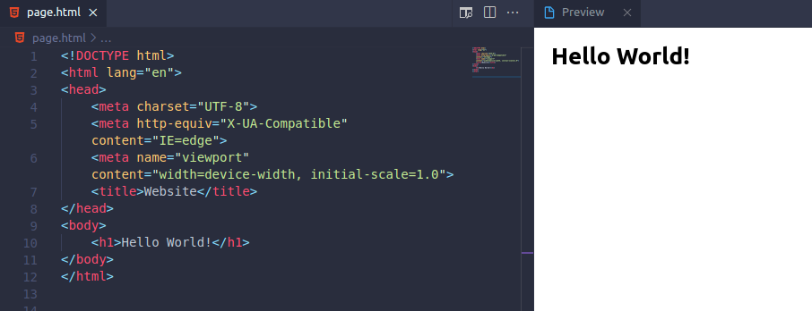

### 2. What are CSS selectors?

Whenever you want to design or edit an webpage, you will a specific tool to said task. Css selectors are a tool to decide which element of the HTML code needs to be selected. This method can be used to call any component expected to be interacted with or be modified by the user. Knowing that, the user must learn a set of rules and the patterns used to select the desired elements. Here are a few basic examples:

<table>
    <tr>
        <th>Selector</th>
        <th>Example</th>
        <th>Example description</th>
    </tr>
    <tr>
        <td>element</td>
        <td>p</td>
        <td>Selects all < p > elements</td>
    </tr>
    <tr>
        <td>.class</td>
        <td>.intro</td>
        <td>Selects all elements with class="intro"</td>
    </tr>
    <tr>
        <td>#id</td>
        <td>#firstname</td>
        <td>Selects the element with id="firstname"</td>
    </tr>
    <tr>
        <td>[attribute]</td>
        <td>[target]</td>
        <td>Selects all elements with a target attribute</td>
    </tr>
    <tr>
        <td>::nth-child(n)</td>
        <td>p:nth-child(2)</td>
        <td>Selects every < p > element that is the second child of its parent</td>
    </tr>
<table>

### 3. What is XPath?

XPath stands for XML Path. It’s a query language that helps identify elements from an XML document. It uses expressions that navigate into an XML document in a way that can be traced from the start to the intended element—like forming a path from the start. Despite being harder to learn and master, XPath has multiple advantages over CSS selectors:

- Creating in XPath is more flexible than in CSS Selector.

- When you don’t know the name of an element, you can use contains to search for possible matches.

- Queries are compact, easy to type and read and easily parsed and can return any number of results, including zero.

- Queries accept multiple conditions. This is specially useful with dinamic elements like for example translated texts.

- It can be used in JavaScript, Java, XML Schema, PHP, Python, C, C++, and lots of other languages.

### 4. Using XPath

At first glance learning XPath might seem a little bit complex, but once mastered, it transforms into a very powerful tool. Here is a list of the XPath selectors and its equivalent to CSS selectors:

### Descendant selectors

Descendant selectors are used to specify the starting point of a selection.

<table>
    <tr>
        <th>XPATH</th>
        <th>Equivalent</th>
    </tr>
    <tr>
        <td>//h1</td>
        <td>h1</td>
    </tr>
    <tr>
        <td>//div//p</td>
        <td>div p</td>
    </tr>
    <tr>
        <td>//ul/li</td>
        <td>ul > li</td>
    </tr>
    <tr>
        <td>//ul/li/a</td>
        <td>ul > li > a</td>
    </tr>
    <tr>
        <td>//div/*</td>
        <td>div > *</td>
    </tr>
    <tr>
        <td>:root</td>
        <td>/</td>
    </tr>
    <tr>
        <td>/body</td>
        <td>:root > body</td>
    </tr>
</table>

Example:

- _//div//span_

### Attribute selectors

Attribute selectors are used to specify the attributes of the elements to be selected.

<table>
    <tr>
        <th>XPATH</th>
        <th>Equivalent</th>
    </tr>
    <tr>
        <td>//*[@id="id"]</td>
        <td>#id</td>
    </tr>
    <tr>
        <td>//*[@class="class"]</td>
        <td>.class</td>
    </tr>
    <tr>
        <td>//input[@type="submit"]</td>
        <td>input[type="submit"]</td>
    </tr>
    <tr>
        <td>//input[@type="submit"]</td>
        <td>a#abc[for="xyz"]</td>
    </tr>
    <tr>
        <td>//a[@rel]</td>
        <td>a[rel]</td>
    </tr>
    <tr>
        <td>//a[starts-with(@href, '/')]</td>
        <td>a[href^='/']</td>
    </tr>
    <tr>
        <td>//a[ends-with(@href, '.pdf')]</td>
        <td>a[href$='pdf']</td>
    </tr>
    <tr>
        <td>//a[contains(@href, '://')]</td>
        <td>a[href*='://']</td>
    </tr>
    <tr>
        <td>//a[contains(@rel, 'help')]</td>
        <td>a[rel~='help']</td>
    </tr>
</table>

Example:

- _//div[@class]_

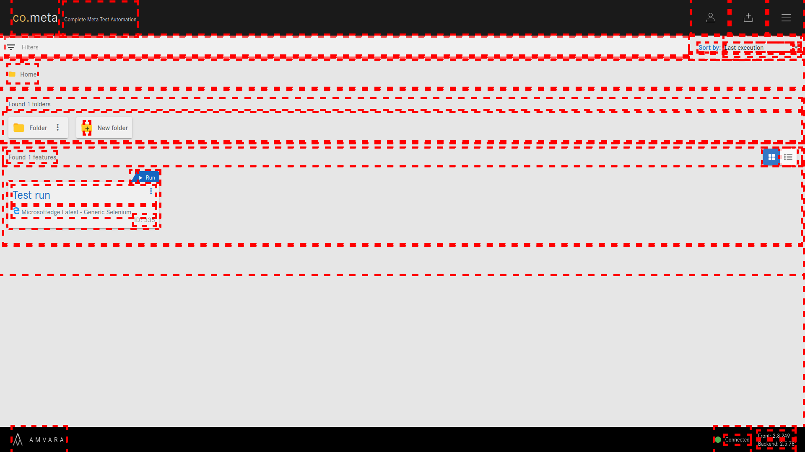

### Order selectors

Order selectors are used to specify the index of the element to be selected inside of a node.

<table>
    <tr>
        <th>XPATH</th>
        <th>Equivalent</th>
    </tr>
    <tr>
        <td>//ul/li[1]</td>
        <td>ul > li:first-of-type</td>
    </tr>
    <tr>
        <td>//ul/li[2]</td>
        <td>ul > li:nth-of-type(2)</td>
    </tr>
    <tr>
        <td>//ul/li[last()]</td>
        <td>ul > li:last-of-type</td>
    </tr>
    <tr>
        <td>//li[1][@id="id"]</td>
        <td>li#id:first-of-type</td>
    </tr>
    <tr>
        <td>//*[1][name()="a"]</td>
        <td>a:first-child</td>
    </tr>
    <tr>
        <td>//*[last()][name()="a"]</td>
        <td>a:last-child</td>
    </tr>
</table>

Example:

- _//div[4]_

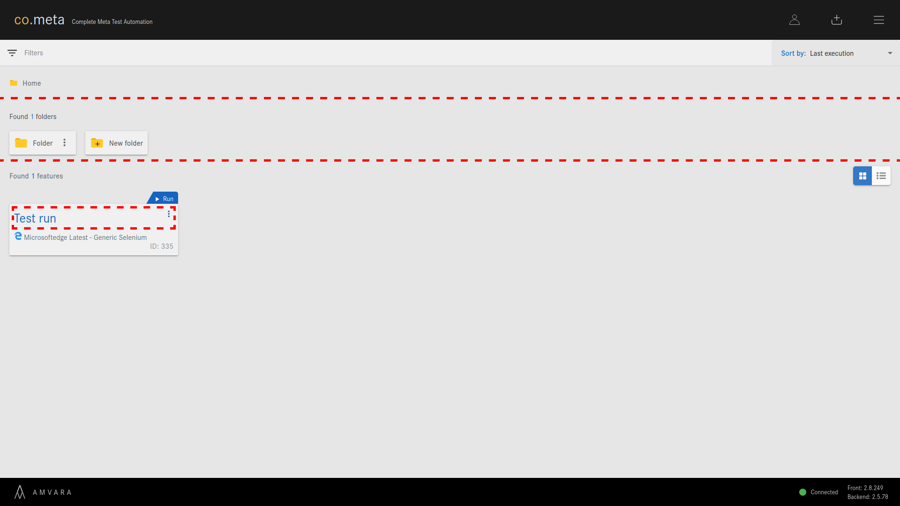

### Siblings

Sibling selections are an extension of the descendant selectors.

The adjacent sibling selector (+) is used to select and element that is directly after another specific element.

The general sibling selector (~) selects all the elements that are next siblings of a specified element.

Sibling elements must have the same parent element, and 'adjacent' means 'immediately following'.

<table>
    <tr>
        <th>XPATH</th>
        <th>Equivalent</th>
    </tr>
    <tr>
        <td>//h1/following-sibling::ul</td>
        <td>h1 ~ ul</td>
    </tr>
    <tr>
        <td>//h1/following-sibling::ul[1]</td>
        <td>h1 + ul</td>
    </tr>
    <tr>
        <td>//h1/following-sibling::[@id="id"]	</td>
        <td>h1 ~ #id</td>
    </tr>
</table>

Example:

- _//div/following-sibling::span_

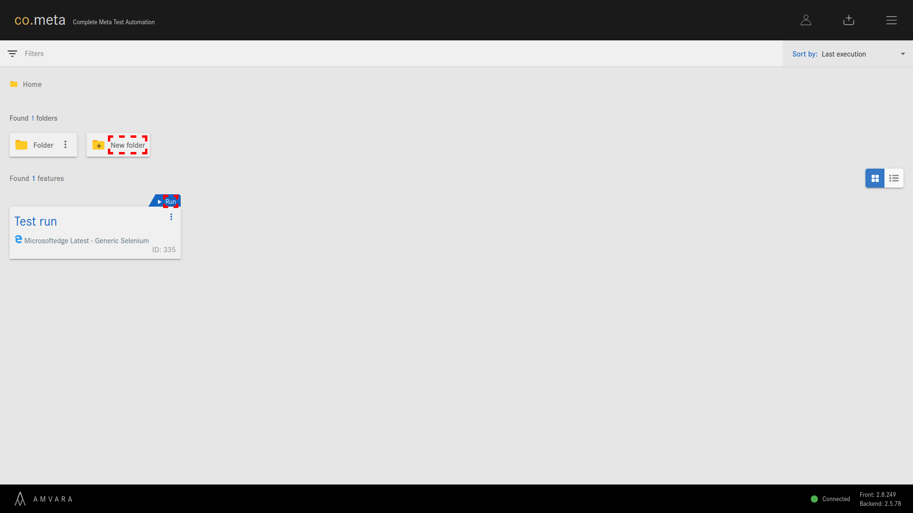

### Jquery selectors

The following XPath selectors have the same functionality as if you were to use JQuery to select an element.

<table>
    <tr>
        <th>XPATH</th>
        <th>Equivalent</th>
    </tr>
    <tr>
        <td>//ul/li/..</td>
        <td>$('ul > li').parent()</td>
    </tr>
    <tr>
        <td>//li/ancestor-or-self::section</td>
        <td>$('li').closest('section')	</td>
    </tr>
    <tr>
        <td>//a/@href</td>
        <td>$('a').attr('href')</td>
    </tr>
    <tr>
        <td>//span/text()</td>
        <td>$('span').text()</td>
    </tr>
</table>

Example:

- _//div/@class_

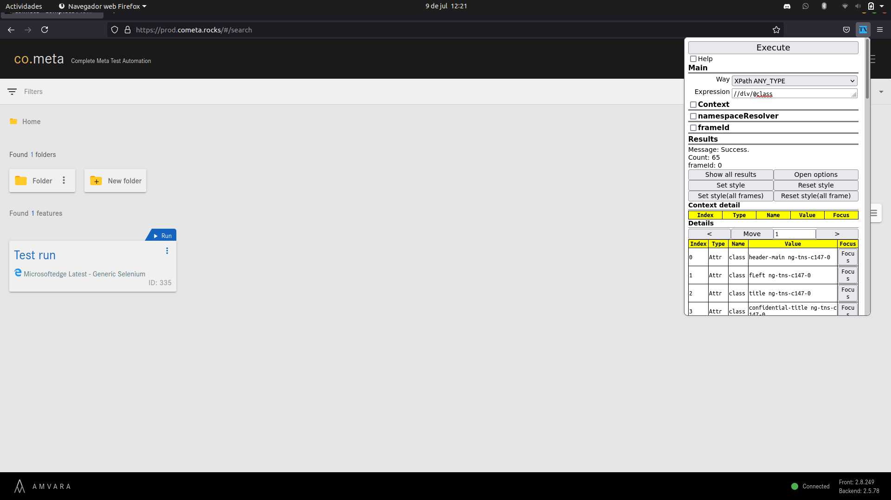

### Other selectors

<table>
    <tr>
        <th>XPATH</th>
        <th>Equivalent</th>
    </tr>
    <tr>
        <td>//h1[not(@id)]</td>
        <td>h1:not([id])</td>
    </tr>
    <tr>
        <td>//button[text()="Submit"]</td>
        <td>Text match</td>
    </tr>
    <tr>
        <td>//button[contains(text(),"Go")]</td>
        <td>Text match (substring)</td>
    </tr>
    <tr>
        <td>//product[@price > 2.50]</td>
        <td>Arithmetic</td>
    </tr>
    <tr>
        <td>//ul[*]</td>
        <td>Has children</td>
    </tr>
    <tr>
        <td>//ul[li]</td>
        <td>Has children (specific)</td>
    </tr>
    <tr>
        <td>//a[@name or @href]</td>
        <td>Or logic</td>
    </tr>
    <tr>
        <td>//a | //div</td>
        <td>Union (joins results)</td>
    </tr>
</table>

Example:

### Steps and axes

A step in XPath is the name of the element or the function used for the query.

An axis represents a relationship to the context (current) node and is used to locate nodes relative to that node on the tree.

<table>
    <tr>
        <th>Axis</th>
        <th>Example</th>
        <th>Explanation</th>
    </tr>
    <tr>
        <td>Axe /</td>
        <td>//ul/li/a</td>
        <td>Selects an element directly below the main element</td>
    </tr>
    <tr>
        <td>Axe //</td>
        <td>//[@id="list"]//a</td>
        <td>Selects an element below the main element, not necessarily directly below</td>
    </tr>
    <tr>
        <td colspan="3">Separate your steps with /. Use two (//) if you don’t want to select direct children.</td>
    </tr>
    <tr>
        <td>Prefix //</td>
        <td>//hr[@class='edge']</td>
        <td>Starts the selection from any element</td>
    </tr>
    <tr>
        <td>Prefix ./</td>
        <td>./a</td>
        <td>Starts the selection from a position relative to a previously selected element</td>
    </tr>
    <tr>
        <td>Prefix /</td>
        <td>/html/body/div</td>
        <td>Starts the selection from the first line of the code</td>
    </tr>
</table>

Example:

- _/html/body/cometa/header/div[1]/div[1]/div[1]_

### Predicates

Predicates are used to find a specific node or a node that contains a specific value. They are always embedded in square brackets.

<table>
    <tr>
        <th>Example</th>
        <th>Explanation</th>
    </tr>
    <tr>
        <td>//div[true()] //div[@class="head"] //div[@class="head"][@id="top"]</td>
        <td>Restricts a nodeset only if some condition is true. They can be chained.</td>
    </tr>
</table>

Example:

### Operators

<table>
    <tr>
        <th>Operator</th>
        <th>Example</th>
    </tr>
    <tr>
        <td>=</td>
        <td>//a[@id = "xyz"]</td>
    </tr>
    <tr>
        <td>!=</td>
        <td>//a[@id != "xyz"]</td>
    </tr>
    <tr>
        <td>+, -, *, div, =, mod</td>
        <td>//a[@priceA + @priceB]</td>
    </tr>
    <tr>
        <td>>, <, <=, >=</td>
        <td>//a[@price > 25]</td>
    </tr>
    <tr>
        <td>and</td>
        <td>//div[@id="head" and position()=2]</td>
    </tr>
    <tr>
        <td>or</td>
        <td>//div[(x and y) or not(z)]</td>
    </tr>
</table>

### Indexing

These are different ways to select and element on a specified index.

<table>
    <tr>
        <th>XPATH</th>
        <th>Explanation</th>
    </tr>
    <tr>
        <td>//a[1]</td>
        <td>Returns the first < a > tag</td>
    </tr>
    <tr>
        <td>//a[last()]</td>
        <td>Returns the last < a > tag</td>
    </tr>
    <tr>
        <td>//ol/li[2]</td>
        <td>Return the second < li > tag</td>
    </tr>
    <tr>
        <td>//ol/li[position()=2]</td>
        <td>Returns the second < li > tag, works the same way as the previous one</td>
    </tr>
    <tr>
        <td>//ol/li[position()>1]</td>
        <td>Returns all the < li > tags starting from the second coincidence</td>
    </tr>
</table>

Example:

- _//div[last()]_

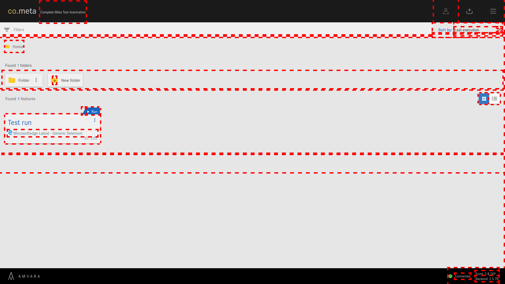

### Chaining order

In a XPath query the order is very important as it will affect the final result. The following examples will return different values.

- a[1][@href='/']

- a[@href='/'][1]

Example:

- _//div[1]/div_

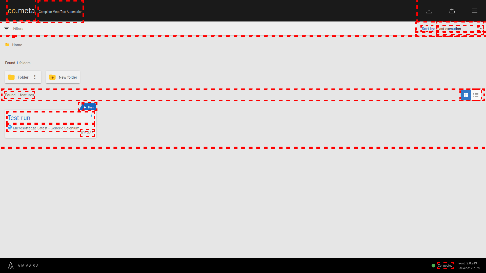

- _//div/div[1]_

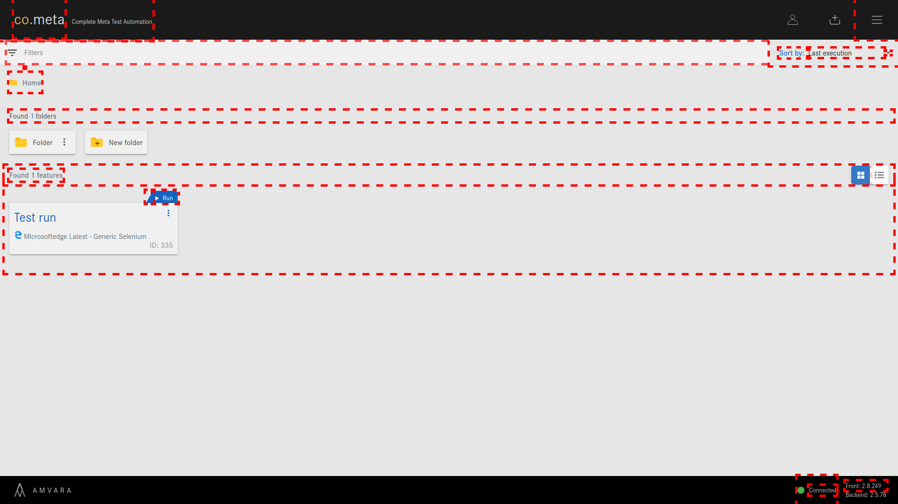

### Node functions

<table>
    <tr>
        <th>XPATH</th>
        <th>Explanation</th>
    </tr>
    <tr>
        <td>name()</td>
        <td>//[starts-with(name(), 'h')]  Returns the elements whose name equals to 'h'</td>
    </tr>
    <tr>
        <td>text()</td>
        <td>//button[text()="Submit"] Returns the elements which have 'Submit' as inner text</td>
    </tr>
    <tr>
        <td>lang(str)</td>
        <td>Checks if the element has the same language as the specified and returns true or false</td>
    </tr>
    <tr>
        <td>namespace-uri()</td>
        <td>Checks if the element has the same namespace-uri as the specified and returns true or false</td>
    </tr>
    <tr>
        <td>count()</td>
        <td>//table[count(tr)] Counts the amount of nodes in a node-set and returns an integer</td>
    </tr>
    <tr>
        <td>position()</td>
        <td>//ol/li[position()=2] Returns a number equal to the context position from the expression evaluation context</td>
    </tr>
</table>

Example:

- _//span[text()="co."]_

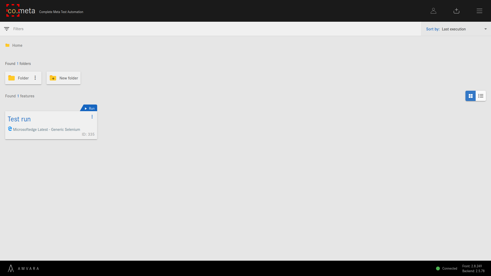

### Boolean functions

<table>
    <tr>
        <th>XPATH</th>
        <th>Explanation</th>
    </tr>
    <tr>
        <td>not(expr)</td>
        <td>button[not(starts-with(text(),"Submit"))] Returns the elements that do not satisfy the inputted conditions</td>
    </tr>
</table>

Example:

- _//span[not(text()="co.")]_

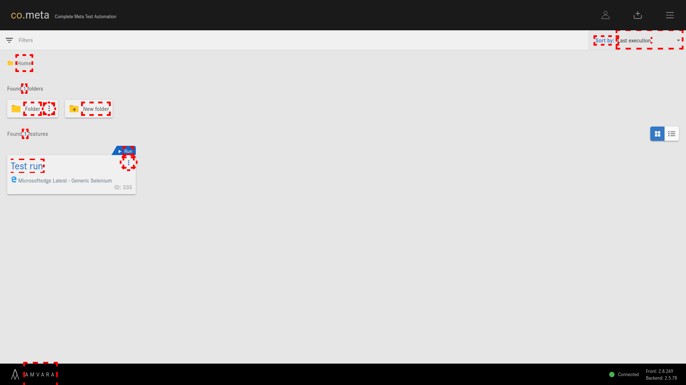

### Type conversion

<table>
    <tr>
        <th>XPATH</th>
        <th>Explanation</th>
    </tr>
    <tr>
        <td>string()</td>
        <td>Converts the result into a string</td>
    </tr>
    <tr>
        <td>number()</td>
        <td>Converts the result into a number</td>
    </tr>
    <tr>
        <td>boolean()</td>
        <td>Converts the result into true or false</td>
    </tr>
</table>

### String functions

<table>
    <tr>
        <th>XPATH</th>
        <th>Explanation</th>
    </tr>
    <tr>
        <td>contains()</td>
        <td>font[contains(@class,"head")] Checks if the element contains the specified string</td>
    </tr>
    <tr>
        <td>starts-with()</td>
        <td>font[starts-with(@class,"head")] Checks if the element starts with the specified string</td>
    </tr>
    <tr>
        <td>ends-with()</td>
        <td>font[ends-with(@class,"head")] Checks if the element ends with the specified string</td>
    </tr>
    <tr>
        <td>concat(x, y)</td>
        <td>Concatenates and returns 2 specified strings</td>
    </tr>
    <tr>
        <td>substring(str, start, len)</td>
        <td>Returns a part of the given string. Str is the string to evaluate, start the position within string where the substring begins and the length is the length of the substring itself. If omitted, it will return the substring from the start position to the end of string</td>
    </tr>
    <tr>
        <td>substring-before(str, sub)</td>
        <td>Returns the string that is part of a given string before a given substring.  substring-before("01/02", "/") returns 01</td>
    </tr>
    <tr>
        <td>substring-after(str, sub)</td>
        <td>Returns the string that is part of a given string after a given substring.  substring-after("01/02", "/") returns 02</td>
    </tr>
    <tr>
        <td>translate(str, abc, XYZ)</td>
        <td>Evaluates a string and a set of characters to translate and return the translated string. str is the string to evaluate, abc is the string of characters that will be replaced, XYZ is the string of characters used for replacement; the first character in XYZ will replace every occurence of the first character in abc that appears in str. 
        < xsl:value-of select="translate('The quick brown fox.', 'abcdefghijklmnopqrstuvwxyz', 'ABCDEFGHIJKLMNOPQRSTUVWXYZ')" / > will return 'THE QUICK BROWN FOX.'   < xsl:value-of select="translate('The quick brown fox.', 'brown', 'red')" / > will return 'The quick red fdx.'</td>
    </tr>
    <tr>
        <td>normalize-space(string)</td>
        <td>Remove leading and trailing white-spaces from a string, replaces sequiences of whitespace characters by a single space and returns the result string</td>
    </tr>
    <tr>
        <td>string-length(string)</td>
        <td>Returns the amount of characters in a given string</td>
    </tr>
</table>

Example:

- _//div[string-length("abc")]_

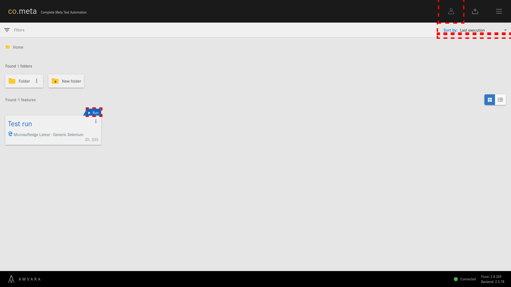

### Unions

In XPath it is possible to join two or more independent queries into a single one

//button[not(starts-with(text(),"Submit"))] | button[not(starts-with(text(),"Send"))]

The previous query returns all buttons that do not contain 'Submit' or 'Send' as inner text.

Example:

- _//div/div/div/div | //span_

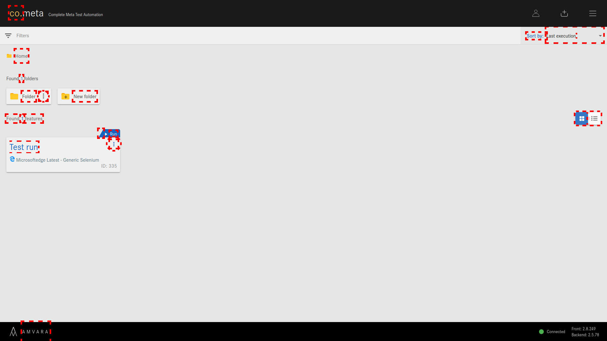

 

As you can see, aside from the already existing CSS selectors XPath offers a greater amount of selection options vastly expanding the querying posibilities. Furthermore, as XPath can be used in many different programming languages, it can become a very useful, flexible and powerful tool in software developing and testing.

### 5. Support

For further questions or issues, please contact us at our email <tec_dev@cometa.rocks> or via Discord https://discord.gg/e3uBKHhKW5
